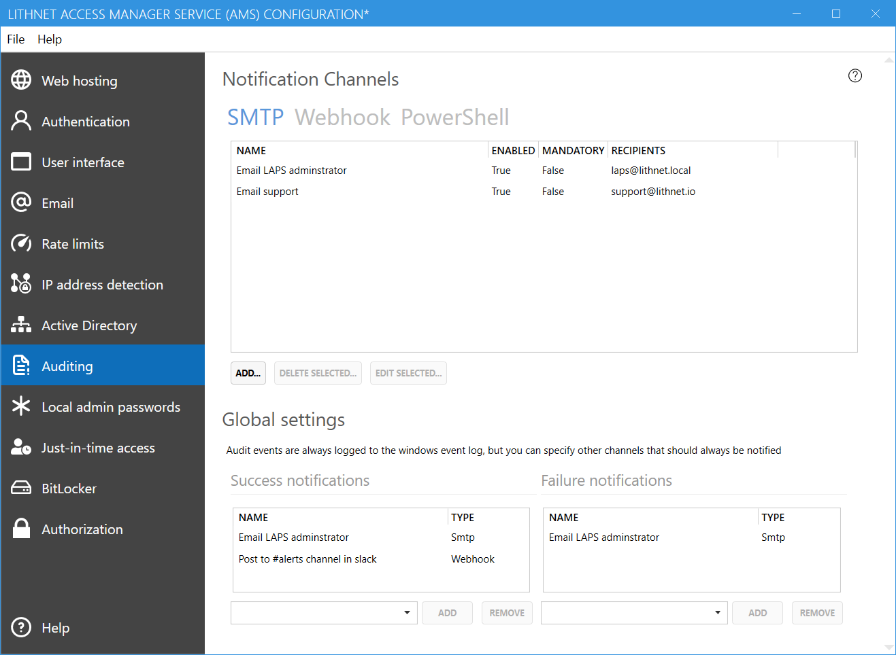
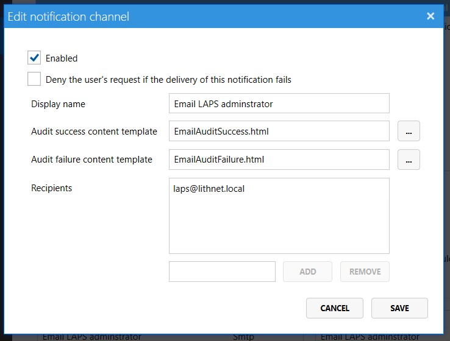
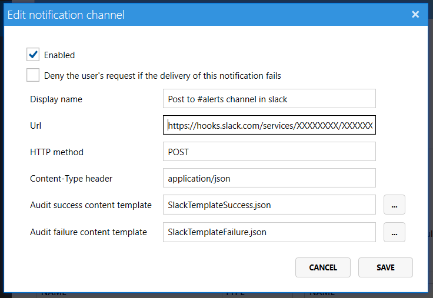
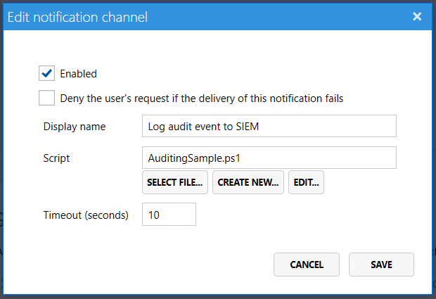

Access Manager always logs events to the Windows event log, but you can also have it deliver notifications via email, web hooks, or even PowerShell.

# Notification Channels
Access Manager uses the concept of a notification channel to define what event information should be sent to where, and how it should be delivered. Notification channels are attached to authorization targets and are sent when access to a computer is granted or denied.

**SMTP channels** allow for the delivery of audit events via a HTML formatted email. 

**Webhooks** are a convenient way to send notifications to 3rd party systems. Using a simple JSON payload, you're able to push audit information to systems that support webhooks such as Microsoft Teams and Slack.

Finally, **PowerShell** can be used to perform custom audit actions and send notifications to any system you can connect to from PowerShell.

## Common notification channel settings
The following settings apply to all channel types

#### Enabled
Indicates if the notification channel is currently enabled. If it is not enabled, audit events will not be sent to this channel.

#### Deny the user's request if the delivery of this notification fails
This setting needs very careful consideration before turning this flag on. When enabled, AMS will wait to grant access to the user until the notification is sent. If the notification channel takes a long time to process, this will result in the user waiting a long time for their access request to process on the web page. Only enable this setting if auditing to the notification channel is critical. It is important to note that events are _always_ logged to the Windows event log. If the request fails to log to the event log, the request is denied. So there will always be at least one record of a successful access attempt.

#### Display name
A friendly name that is used through the configuration tool to refer to this notification channel.

## SMTP Channels

#### Audit success content template
A HTML file used as a template for a successful access request

#### Audit failure content template
A HTML file used as a template for a failed access request

AMS comes with a sample success and failure HTML template that you can customize to suit your requirements. See the page on [[audit variables]] for a list of the fields that are valid to use inside the email template.

#### Recipients
A list of email recipients that the audit notification should be sent to

## Webhook Channels

#### URL
This is the webhook URL provided by the target application. 

#### HTTP Method
Specifies the type of HTTP request to make. This will almost always be `POST`, but in the event that your web hook target requires another value you can specify that here.

#### Content-Type header
Specifies the `Content-Type` header used in the HTTP request. This will almost always be `application/json` for a JSON payload. If your web hook target requires a different value, then specify that here.

#### Audit success content template
A file containing the payload to send to the webhook for a successful access request

#### Audit failure content template
A file containing the payload to send to the webhook for a failed access request

## PowerShell Channels

#### Script
Select the PowerShell script file to execute. You can select an existing file, create a new file from the built-in template, or open the specified file in the default PowerShell script editor (usually PowerShell ISE)

# Global settings
The global settings section defines which channels should be always notified of a success or failure event. This is in addition to any notification channels defined on a specific authorization target. 

If you want to make sure a channel is notified on every success or failure, then add those channels to this list.

# Template variables
All notification channel types populate notification templates by replacing placeholder variables with data from the event. The [[audit variables]] page contains a full list of all valid variables that you can use throughout your templates and scripts.