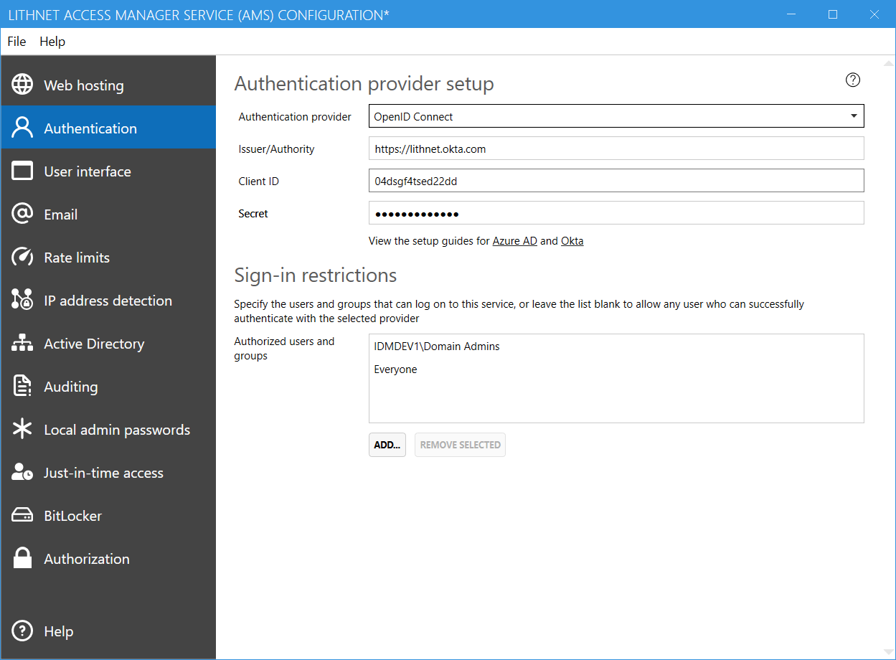
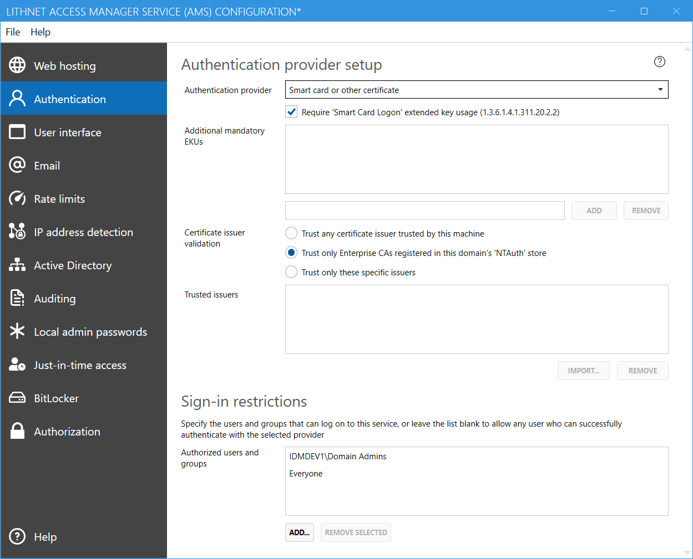
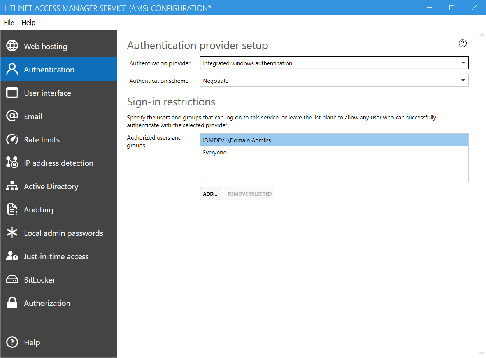

## Authentication Provider
The Access Manager web service allows you to choose one of several different types of authentication providers. It is recommended to use modern authentication using a mechanism such as OpenID Connect, where an identity provider can provider high assurance authentication utilizing passwordless or multi-factor authentication.

Access Manager supports modern identity providers such as Azure AD and Okta out of the box.

## OpenID Connect
OpenID Connect is the preferred authentication provider. Coupled with a modern IDP like Azure AD or Okta, you can provide strong authentication to your application, backed up by multi-factor authentication. See the guides for setting up Access Manager to work with [[Azure AD|Setting-up-authentication-with-Azure-AD]] or [[Okta|Setting-up-authentication-with-Okta]].

Using OpenID Connect requires that your identity provider pass a `upn` claim containing the on-premises Active Directory UPN of your users.

## WS-Federation
WS-Federation can be used to delegate the authentication process to an on-prem ADFS or similar product. Read the [[setup guide|Setting-up-authentication-with-ADFS]] for configuring Access Manager to work with ADFS.

Using WS-Federation requires that your identity provider pass a `upn` claim containing the on-premises Active Directory UPN of your users.

## Smart-card or other certificate
Certificate-based authentication is provided by Access Manager, with the optional support for requiring smart-card authentication.

Certificates must contain a `principal name` attribute in their `Subject Alternative Names` which specifies the user's UPN as found in Active Directory.

Limited support is available for use of [[altSecurityIdentities|Enabling AltSecurityIdentities]] in cases where certificates are used without a UPN, however these are not supported outside the forest where AMS is located.

### Additional mandatory EKUs
Specify any custom EKUs that must be present in the certificate for the authentication to be successful.

### Certificate issuer validation
You must select how you want to validate the certificate issuer. Note that no matter which validation option is selected, at a minimum all certificates must be validated up to a trusted CA on the machine that runs AMS.

#### Trust any certificate issuer trusted by this machine
Use this option to only require that the certificate was issued by an issuer trusted by this machine. This option isn't recommended, as any CA could potentially issue a certificate that you may trust.

#### Trust only Enterprise CAs registered in this domains `NTAuth` store
Active Directory Enterprise CAs are automatically registered in the directory itself as trusted issuers. CAs in the Enterprise `NTAuth` store are trusted to issue logon certificates within the domain. If you select this option, then only certificates issued by one of these CAs are trusted. (Recommended options for smart card certificates)

#### Trust only these specific issuers
This option allows you to import a specific certificate authority's certificate that must be present in the certificate chain for it to be accepted. This can be a subordinate CA, rather than a root certificate. You can add  multiple trusted issuers to this list, but only one of them needs to be present in the client's certificate chain.

## Integrated Windows Authentication
The Integrated Windows Authentication (IWA) provider allows users to login with NTLM or Kerberos authentication. In order to use kerberos, the web site host name must be registered on the SPN of the computer object (not the service account). Eg if using a hostname of `accessmanager.lithnet.io`, you'll need to register the SPN `http/accessmanager.lithnet.io` or `host/accessmanager.lithnet.io`. If the host name matches the AD computer name, then no additional SPNs are required.

### Authentication Scheme
Select one of the following authentication options
- Basic: Uses basic authentication (username/password) - Not recommended
- NTLM: Use NTLM authentication only
- Negotiate: Use kerberos if possible, otherwise fall back to NTLM

## Sign-in restrictions
Specify the users and groups that should be allowed to log into this service, or leave the field blank to allow anyone who successfully authenticates to login