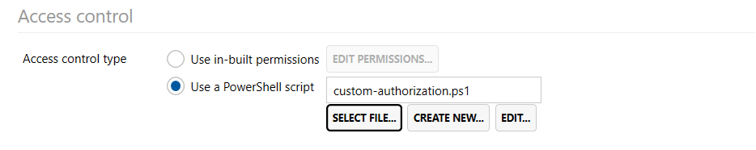

## Script-based authorization


If you'd like to make authorization decisions outside of a static ACL model, you can utilize a PowerShell script to do this.

Access Manager can call a script that contains a function called `Get-AuthorizationResponse` that takes a user, computer, and logger as input parameters. From there you can make a decision on what the user should be allowed or denied access to, or choose to not make an authorization decision at all.

Access Manager uses the response you provide to create a dynamic ACL for the user, and includes it in the access evaluation of all applicable targets.

## Example script

```ps
function Get-AuthorizationResponse{
	param(
	$user,
	$computer
)
	Write-Information  "We're in PowerShell!"
	Write-Information "Checking if $($user.MsDsPrincipalName) is allowed access to $($computer.MsDsPrincipalName)"

	# Create an object to hold our authorization decisions
	# Set IsAllowed to true to allow access, or set IsDenied to explicitly deny access, or leave both as false if no decision was made. This will allow other rules to be evaluated.
	$response = [PSCustomObject]@{
		IsLocalAdminPasswordAllowed = $false
		IsLocalAdminPasswordDenied = $false
		IsLocalAdminPasswordHistoryAllowed = $false
		IsLocalAdminPasswordHistoryDenied = $false
		IsJitAllowed = $false
		IsJitDenied = $false
		IsBitLockerAllowed = $false
		IsBitLockerDenied = $false
	}

	# Return the authorization response to Access Manager to process
	Write-Output $response;
}
```
## Logging information
You can use the Write-Information, Write-Warning, Write-Verbose cmdlets to write to the AMS log file and document your authorization decisions. Note that if you use Write-Error, or if an exception is thrown and not handled, the authorization evaluation for the entire access request will fail.

## Performance
Be aware of performance when writing external authorization scripts. From the user's perspective, they will be waiting in the browser while the access evaluation takes place. If you have a slow script, or lots of scripts, this wait time may seem excessive. 

Scripts that take longer than 30 seconds to complete will be terminated by Access Manager, and the user's authorization request will fail.

## $user object
The user object has the following properties you can access

### MsDsPrincipalName
The NT4-style name of the user (eg `DOMAIN\user`)

### Sid
The Security Identifier of the user (eg `S-1-5-x`)

### SamAccountName
The samAccountName of the user (eg `user`)

### DisplayName 
The display name of the user

### UserPrincipalName
The user's UPN (eg `user@domain.local`)

### Description
The value of the description field in active directory, if present

### EmailAddress
The user's email address (eg `user@domain.com`)

### GivenName
The user's given name

### Surname
The user's surname

## $computer object
The computer object has the following properties you can access

### MsDsPrincipalName
The NT4-style name of the computer (eg `DOMAIN\PC1$`)

### Sid
The Security Identifier of the computer (eg `S-1-5-x`)

### SamAccountName
The samAccountName of the computer (eg `PC1`)

### DisplayName 
The display name of the computer

### Description
The value of the description field in active directory, if present