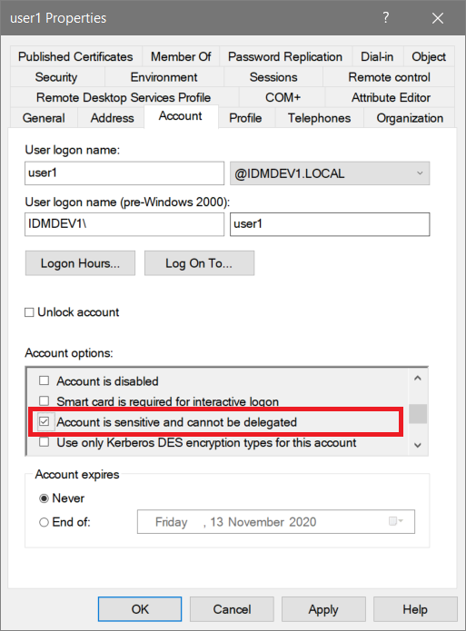
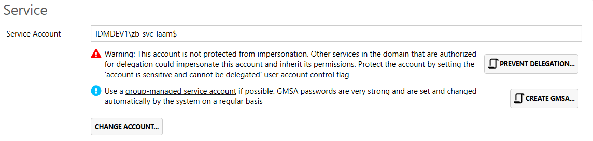

### Account type
We strongly recommend using a [group-managed service account (GMSA)](https://docs.microsoft.com/en-us/windows-server/security/group-managed-service-accounts/group-managed-service-accounts-overview) for the service process to run under.

Group-managed service accounts, introduced in Windows Server 2012, provide a fantastic way to secure your service account by letting the Active Directory itself take care of generating, and rotating, the password. Just like a computer account, the password is a strong, random sequence of 128 bits. You'll find a script at the end of this page for creating a GMSA.

You can use a standard user account if you prefer, but make sure you keep the service account password safe and secure. Access to this service account means access to large numbers of machines in your Active Directory. Treat the Access Manager server and service account with the same level of security as you would a domain controller or domain admin account.

### An important note about delegation
One of the most important protections you should implement, is ensuring that the AMS service account cannot be delegated. That is, other services in your domain that are allowed to impersonate other users in the domain, should be explicitly prevented from being able to impersonate the AMS service account. This is achieved through the use of the `Account is sensitive and cannot be delegated` userAccountControl flag. This is accessible in the properties window of an AD account for a standard user, but must be set with PowerShell for a GMSA. The GMSA script provided below already takes care of this.



### Domain permissions
AMS does need specific rights depending on how you plan to use it. For example, if you are reading Microsoft LAPS passwords, then you'll need to ensure the appropriate read permissions are granted. If you are using it for JIT access, then the ability to modify membership of certain groups is needed. The AMS configuration tool provides all the scripts needed to delegate just the permissions that are needed for the scenarios you want to use.

Resist the temptation to add the AMS service account to groups such as domain admins. It doesn't need those rights, no service ever does. If you are having access issues, raise an issue on github and we'll be happy to troubleshoot and help you resolve the problem.

### User interface warnings
We do take these recommendations seriously, and as such, the UI will alert you in the event of a change of configuration



### Create a group-managed service account
```powershell
# Create-GroupManagedServiceAccount
#
# This script enables the KDS service in the domain if it is not already enabled,
# and creates a new group-managed service account to use with the Access Manager service
#
# This script requires membership in the Domain Admins group
#
# Version 1.0

#-------------------------------------------------------------------------
# Set the following values as appropriate for your environment
#-------------------------------------------------------------------------

$amsServerName = "$(env.MachineName)" # Set this to the name of the server you are installing AMS on,
$accountName = "svc-lithnetams"
$description = "Service account for the Lithnet Access Manager Service"

#-------------------------------------------------------------------------
# Do not modify below here
#-------------------------------------------------------------------------

$ErrorActionPreference = 'Stop'
$InformationPreference = 'Continue'

try 
{
    $ComputerExists = Get-ADComputer -Identity $amsServerName -ErrorAction Stop
} 
catch 
{
    Write-Warning "Computer account $amsServerName doesn't exists. Terminating."
    return
}

$RootKey = Get-KdsRootKey

if (-not $RootKey) 
{
    Write-Host 'In order to create a group-managed service account, a KDS key must be generated for this domain. If this is a non-production domain, you can generate a new key with immediate effect, otherwise you must wait 10 hours for the key to replicate to all DCs before proceeding.' -ForegroundColor Yellow
    Write-Host 'Visit the following site to learn more: https://docs.microsoft.com/en-us/windows-server/security/group-managed-service-accounts/create-the-key-distribution-services-kds-root-key' -ForegroundColor Yellow
    $result = Read-Host -Prompt 'Do you want to create the key with immediate effect? Y/N'

    if ($result -eq "Y")
    {
        Write-Host "Generating KDS root key with immediate effect" -ForegroundColor Green
        $key = Add-KdsRootKey -EffectiveTime ((get-date).AddHours(-10))
    }
    else
    {
        Write-Host "Generating KDS root key" -ForegroundColor Green
        $key = Add-KdsRootKey -EffectiveImmediately
    }

    Sleep 5
}

$RootKey = Get-KdsRootKey

if (-not $RootKey)
{
    Write-Warning "KDS Root Key not available. Terminating."
    return
}

$remainingTime = $RootKey.EffectiveTime.AddHours(10).Subtract((Get-Date));

if ($remainingTime -gt 0) 
{
    Write-Warning "The KDS root key is not yet available. Microsoft recommend waiting 10 hours before using the KDS key, to ensure it has had time to replicate to all domain controllers. The KDS key will be ready in $($remainingTime). Please re-run this script after that time."
    return
}

try 
{
    New-ADServiceAccount -Name $accountName -AccountNotDelegated $true -Description $description -Enabled $true -KerberosEncryptionType AES256, AES128 -SamAccountName $accountName -RestrictToOutboundAuthenticationOnly -ErrorAction Stop
}
catch
{
    Write-Warning "New-ADServiceAccount - Error creating GMSA account. Terminating with error: $($_.Exception.Message)"
    return
}

try 
{
    Set-ADServiceAccount -Identity $accountName -PrincipalsAllowedToRetrieveManagedPassword $ComputerExists.SamAccountName
}
catch 
{
    Write-Warning "Set-ADServiceAccount - Error assigning GMSA account. Terminating with error: $($_.Exception.Message)"
    return
}

$serviceAccountName = "$((Get-ADDomain).NetbiosName)\$accountName$"

Write-Host "You may need to wait for domain replicate to complete before you are able to use the account" -ForegroundColor Yellow
write-Host
Write-Host "The service account has been created. Use $ServiceAccountName in the installer." -ForegroundColor Yellow
```