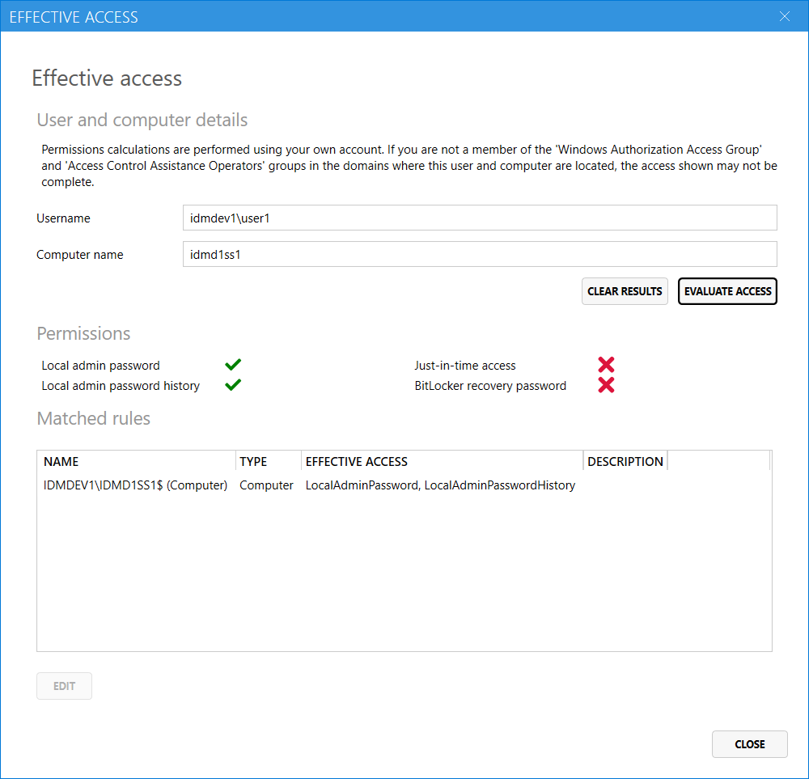

The Access Manager UI can calculate the effective permissions for a user. 
Simply provide a username and computer name and click `Evaluate access` to see what permissions the user has, and which rules grant that permission.

> Note, that the evaluation is performed using the access of the logged in user, not the AMS service account. If you are not a member of the `Windows Authorization Access group` or the `Access Control Assistance Operations` groups, then the access shown may not be complete.
