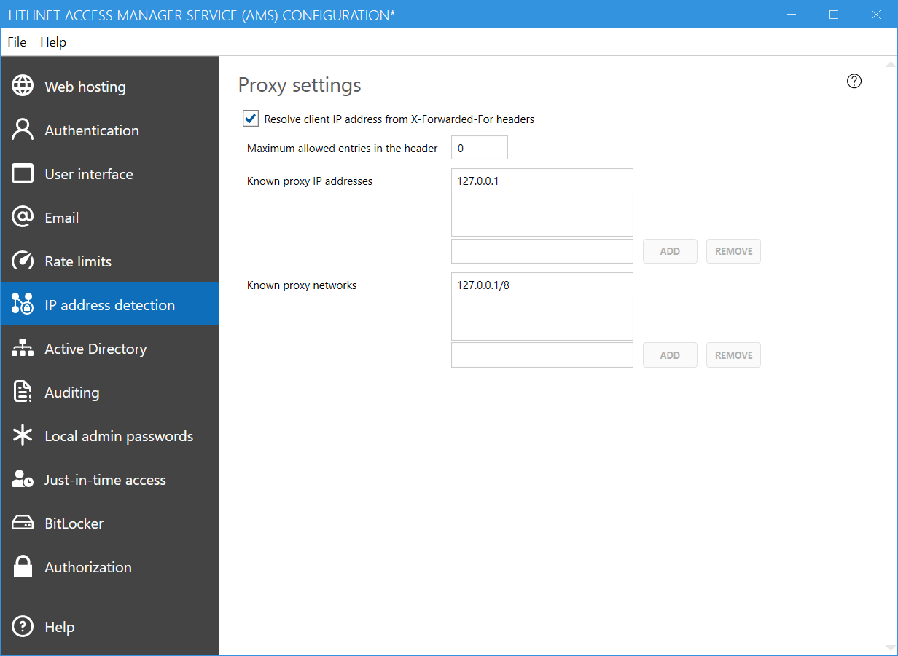

# Proxy Settings

If you place AMS behind a reverse proxy or load balancer, you'll need to configure AMS to correctly find the real client IP address from the X-Forwarded-For header. This will ensure that rate limiting and audit logging are working against the correct IP.

#### Resolve client IP address from X-Forwarded-For headers
Indicates that the client IP address should be extracted from the X-Forwarded-For headers. If this setting is off, the client IP address is determined from the IP address of the machine that connects to the AMS service.

#### Maximum allowed entires in the header
The X-Forward-For header can be set by the client, and therefore can be spoofed. If you have a single load balancer or proxy in front of the AMS service, then set this to `1`. This indicates that only the first entry in the X-Forwarded-For header should be used, and the others ignored.

#### Known proxy IP addresses
If you know the IP addresses of your proxy servers, you can add them here. AMS will use the IP address in the X-Forwarded-For header that appears after these known IP addresses.

#### Known proxy networks
If you know the network range that your proxy servers live in, you can use that instead of individual IPs. Any IP addresses in these ranges will be treated as trusted proxy addresses when resolving the real client IP.
