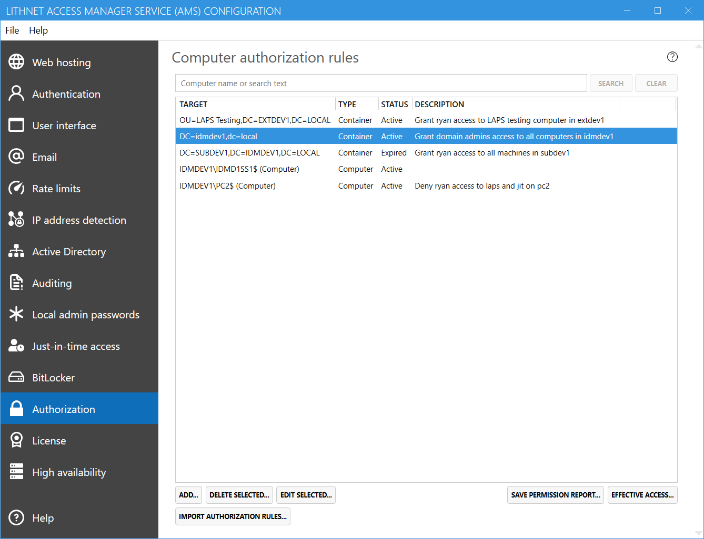
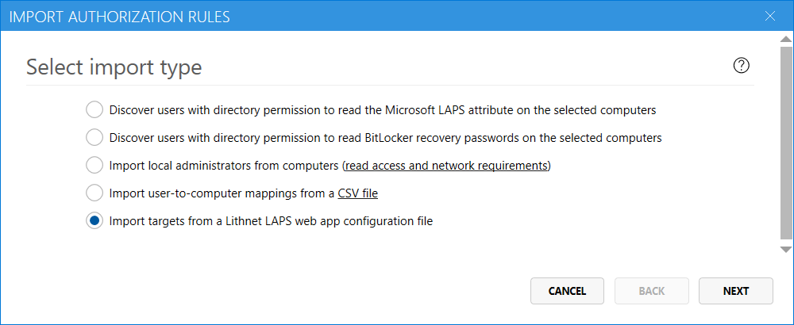
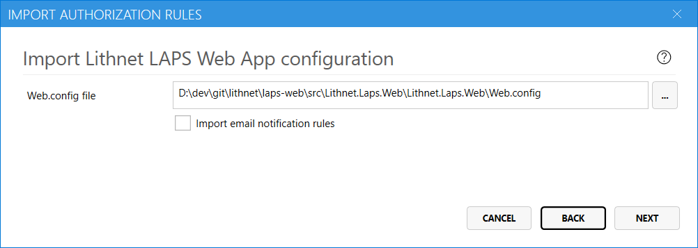
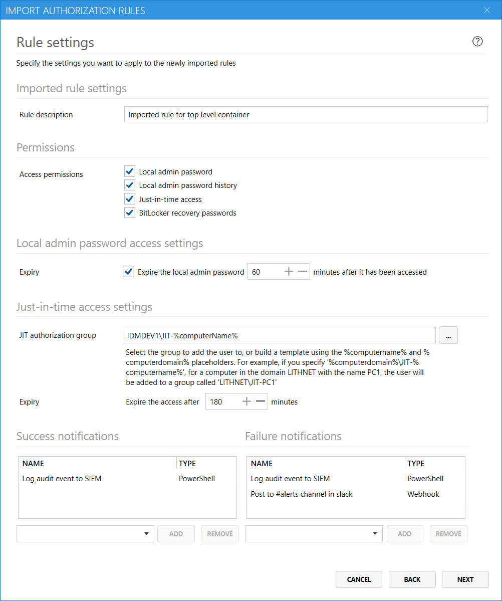
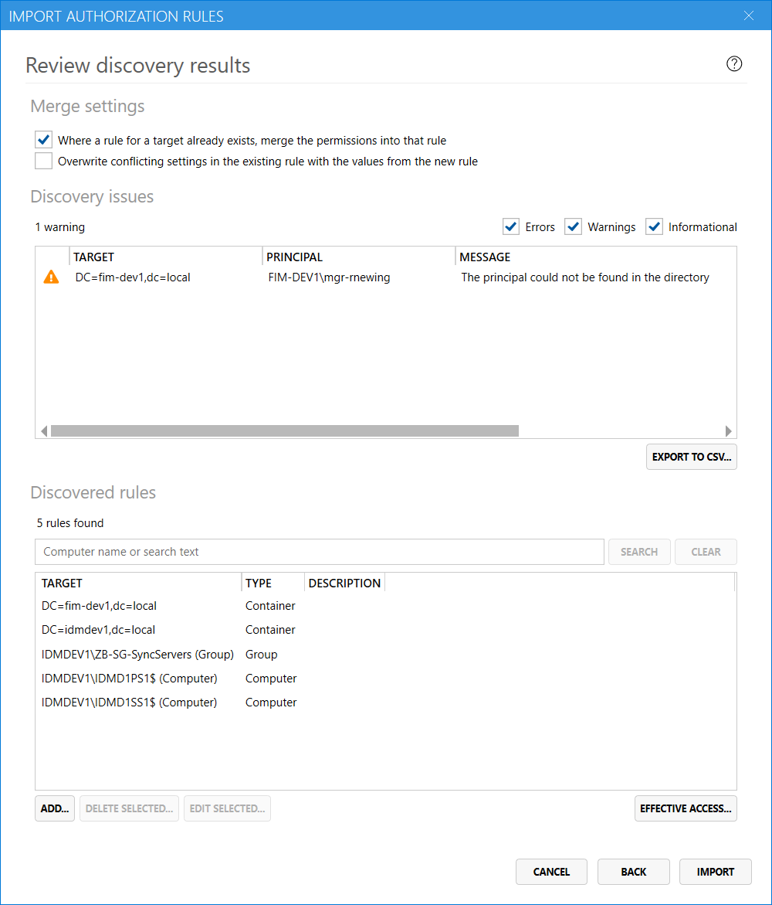

If you had the [Lithnet LAPS Web App](https://github.com/lithet/laps-web) installed (the predecessor to Lithnet Access Manager), you can import your `target` rules and notifications from the `web.config` file.

## Open the import wizard
Using the Lithnet Access Manager Configuration Tool, navigate to the `Authorization` page, and click `Import authorization rules...`

## Select the import type
Select the Lithnet LAPS web app import type, and click `Next`

## Select the web.config file
Specify the path to the web.config file, and check the box if you'd like to also import your email notification settings.

## Specify rule settings
On this page, you can specify the settings for the newly created authorization rules. Choose the permissions you want to assign to the discovered users, and any notifications channels that should apply. 

## Review discovery results
Once the discovery process has completed, you can review the proposed rules before committing them to the authorization store. 

### Merge settings
When a new rule is discovered for a target (computer, group or container) that matches the target of an existing rule, Access Manager will just add the new permissions to the existing rule, rather than create a new rule. You can control this behavior with by unselecting the corresponding check box. 

When merging rules, settings from the _existing rule_ are retained when a conflict is found. For example, if an existing rule is configured to expire LAPS passwords after one hour, and the new rule is configured to expire them after two hours, then the settings from the existing rule are retained. You can alter this behavior by selecting the appropriate check box.  

### Discovery issues
If any issues are found during the discovery process, a `Discovery issues` section is shown. You can export this list to a CSV file and review the issues before proceeding with the import.

### Discovered rules
The discovered rules section shows the proposed rules that Access Manager will create. You can add, edit and delete these rules before finalizing the import. The `effective access` tool can be used to test the proposed rules, and ensure the right users have access to the computers you expect.

### Complete the import
When you have completed your review, and are happy with the proposed rules, click `Import` to merge them into the authorization store.

