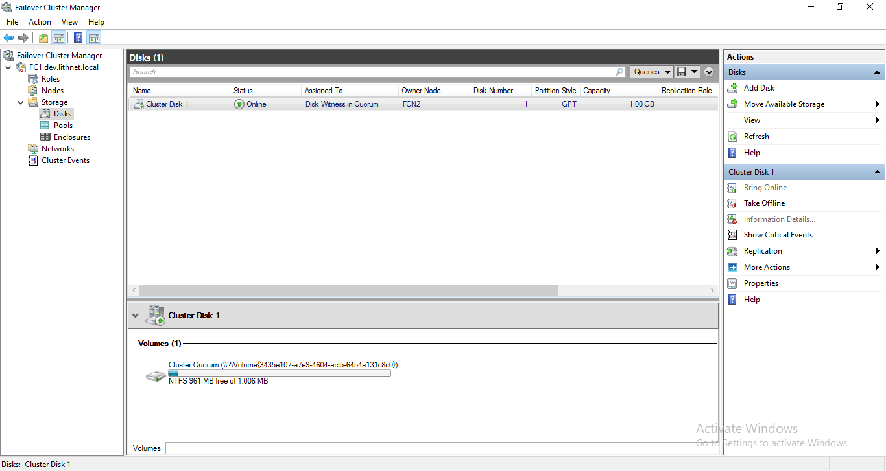
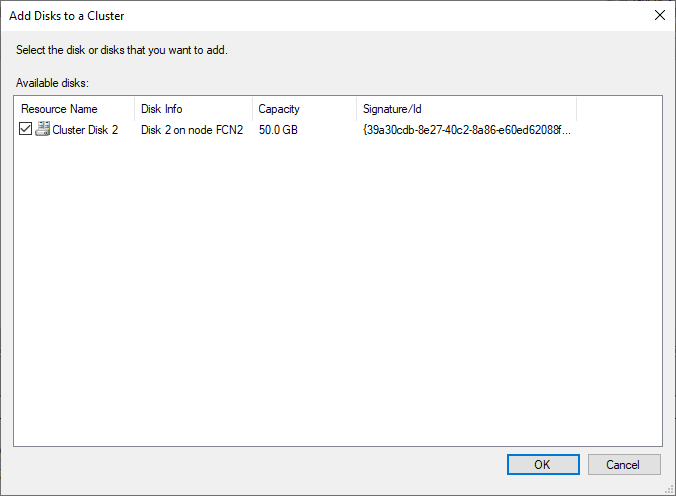
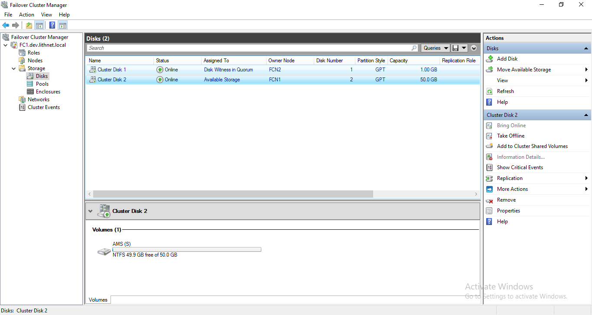
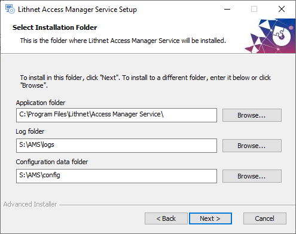
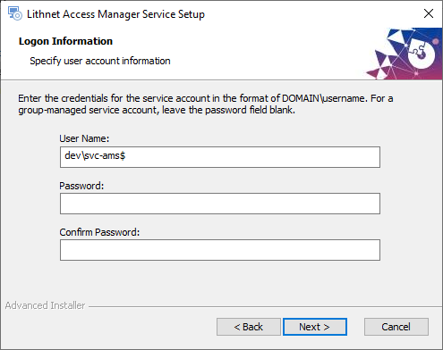
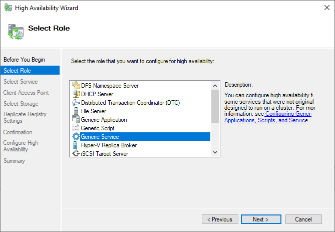
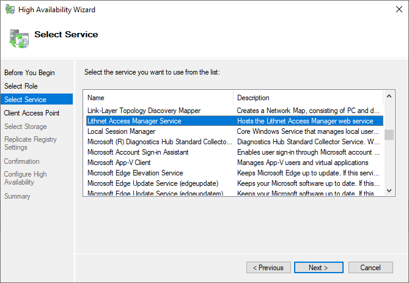
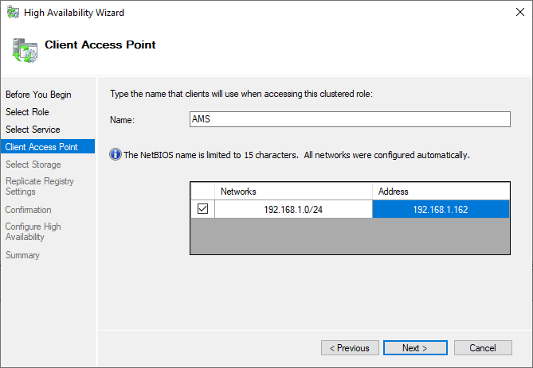
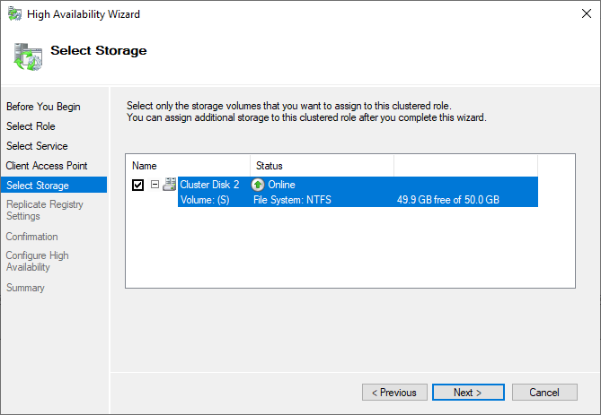
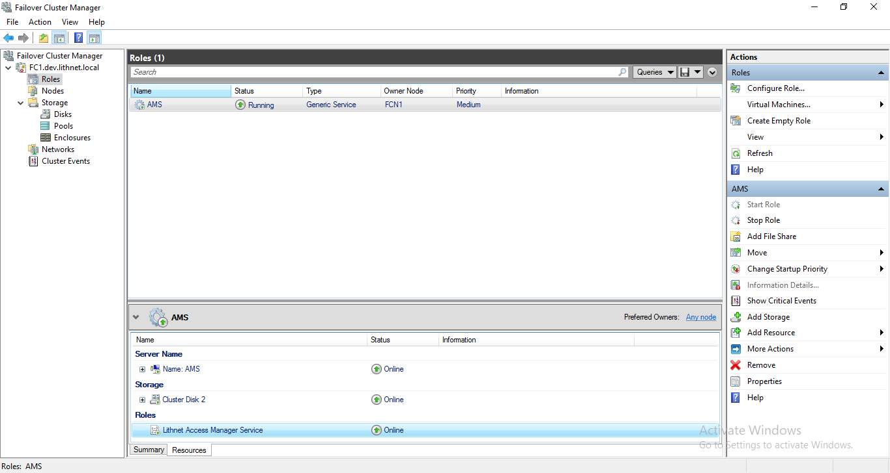

>   High availability is an [[Enterprise edition feature|Access Manager Editions]]

## Prerequisites
Installing Access Manager in a failover cluster requires the following;
- A Lithnet Access Manager enterprise edition license
- You must meet the hardware and storage requirements for a [Microsoft failover cluster](https://docs.microsoft.com/en-us/windows-server/failover-clustering/clustering-requirements)
- A shared disk available to all cluster nodes (Recommended minimum size is 50GB)
- At least one Windows Server 2012 R2 domain controller in the domain where AMS will be installed
- The [KDS root key](https://docs.microsoft.com/en-us/windows-server/security/group-managed-service-accounts/create-the-key-distribution-services-kds-root-key) in the domain must be enabled

## Installation procedure 
### 1. Install and configure the base cluster service
Follow the steps outlined in [Microsoft documentation](https://docs.microsoft.com/en-us/windows-server/failover-clustering/create-failover-cluster) for creating a new failover cluster. Stop once you reach the section for `Creating clustered roles` and continue from this guide.

### 2. Configure the cluster quorum
If you are setting up a cluster containing an even number of nodes, you must configure an appropriate [witness](https://docs.microsoft.com/en-us/windows-server/failover-clustering/manage-cluster-quorum) to ensure a cluster quorum.

### 3. Configure the AMS storage volume online
- Open the `Disk Management` tool, and bring the AMS storage volume online. Initialize the disk, format it, and assign it a drive letter (for the purposes of this guide, we will refer to the AMS storage volume as `S:`)
- Open the `Failover Cluster Manager` tool, expand the cluster in the left hand side tree view, and select `Storage` followed by `Disks`

- Select `Add Disk` from the right-hand actions menu, and add the appropriate disk to the cluster. 

### 4. Install Access Manager
- On the first node, run the Access Manager Service installer.
- When prompted to provide the installation paths, set the log and config folders to be on the `S:` drive. Eg `S:\AMS\logs` and `S:\AMS\config`

- We also recommend using a group-managed service account for AMS. You must use the same account on all cluster nodes.

- When the installer finishes, do not run the configuration utility when prompted.
- Exit the installer and return to the `Failover Cluster Manager`
- From the actions pane, select `Move Available Storage` and select the next node in the cluster. Confirm that the `owner node` for the storage has changed to the correct node.
- Log onto the next node, and ensure the `S:` drive is present. 
- Run the AMS installer again, providing the exact same paths and service account as you did on the primary node.
- Repeat this process for all remaining cluster nodes

### 5. Install the cluster role
- Once AMS has been installed on all nodes, open the `Failover Cluster Manager` and go to the `Roles` node of the cluster
- Click `Configure rule...` from the actions pane
- Select `Generic service` as the role type

- Select `Lithnet Access Manager Service` from the services list

- Provide an IP address and name for your client access point. This will be the name of the clustered service, and by default, forms the AD hostname of the cluster.

- Select the storage volume that contains the AMS configuration

- Click `Add` on the `replicate registry settings` screen, and specify the following value `SOFTWARE\Lithnet\Access Manager Service\Parameters`
- Complete the remaining steps of the wizard, and ensure the new role transitions to an 'online' state

### 6. Configure AMS for high availability
- Use the `Failover Cluster Manager` to determine which node currently hosts the AMS service, and log onto that node
- Open the AMS configuration utility
- From the `Web hosting` page, select or import the SSL certificate 
- From the `Licensing` page, click `Enter license key` and provide your enterprise license
- From the `High availability` page, select `Enable cluster-compatible secret encryption` and `Enable encryption certificate synchronization` (unless you are storing your certificates in a HSM).
- Save the configuration at this point. Restart the service when prompted.
- Close the AMS configuration utility
> Note, the configuration utility requires access to the configuration file, and therefore can only be active on the cluster node that has access to the share storage volume. Always ensure you close the configuration utility before failing over to another node.
- Use the `Failover Cluster Manager` to move the role to the next node
- Open the AMS configuration utility
- From the `Web hosting` page, select or import the SSL certificate
- Save the configuration and restart the service when prompted
- Repeat the certificate selection process on the remaining nodes in the cluster.

At this point, the cluster-specific configure is complete. You can now follow the steps in the [[installation guide|Installing the Access Manager Service]] for configuring the AMS features as appropriate for your environment.

