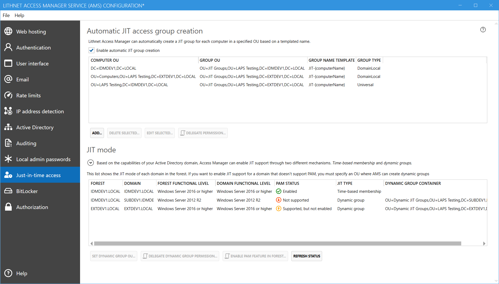

Lithnet Access Manager supports granting access to computers using a just-in-time access model. 

The JIT model used by Lithnet Access Manager involves 3 processes.
1. A group is created in AD to provide JIT access to a specific computer
2. The group is added to the local administrators group of that computer
3. When a user requests just-in-time access to a computer, they are added to this group, for a limited period of time.

The first process can be manged by AMS. It can be configured to automatically create groups for all computers in an OU. 

The second process is managed by group policy preferences. GPP is configured to add the JIT group to the local administrators group of the computer.

Finally, the AMS service through its access request and authorization process, can add members to a group for a limited period of time.

# JIT access group creation
You can use AMS to automatically create a JIT group for every computer in a given OU. Note this doesn't have to be done by AMS if you have another tool you wish to use to create groups.

Select `Enable automatic JIT group creation` and press the `Add...` button to create a new mapping. Once the mapping has been created, use the `Delegate permission...` button to generate a script that grants AMS the rights it needs to manage the JIT groups.

## JIT group mapping

#### Computer OU
Select the container that contains the computers you want to create JIT groups for, and select if access manager should find computers that exist in all child containers, or just the container specified.

#### Group OU
Select the container that access manager should create the group objects within. If you want to clean up groups created for computers that have been deleted, then tick the `delete groups...` tick box. Note, any group found in this container that doesn't match an expected JIT group will be deleted. Do NOT select this option if the OU contains groups that are NOT created by AMS.

#### Group name template
Specify the name of the group that should be created. You must use the `{computerName}` placeholder somewhere in the name. If you use the template `JIT-{computerName}` then for a computer named `PC1` AMS will create a group called `JIT-PC1`

#### Group type
Select the type of group to create. There is rarely a reason to change this from the default of `domain local`

The AMS service checks every 60 seconds for new computers in the domain, and will create a group for any new computers it finds. Once an hour, the service will do a full synchronization of groups and computers. Only at this time will missing computers be detected, and groups deleted if the mapping is configured to do so.

# JIT mode
Based on the capabilities of your Active Directory domain, Access Manager can enable JIT support through two different mechanisms. _Time-based membership_ and _dynamic groups_.

### Time-based membership
_Time-based membership_ is the superior option, as it leverages the _Privileged Access Management (PAM)_ feature in Active Directory. This allows AMS to add the user to the JIT group, with a time limit on that membership. Once that limit expires, the membership is automatically removed by AD itself. 

The key feature of this mode, is that the Kerberos ticket the user obtains will only last as long as the group membership. Combined with membership in the `Protected Users` group, you can be assured that the user's access will expire precisely when then group membership expires. However, time-based membership requires enabling the AD _Privileged Access Management_ feature, which is only supported on Windows Server 2016 and later forest functional levels.

### Dynamic groups
_Dynamic groups_ are supported in all Windows Server 2003 and later domains, and leverage an AD feature called _dynamic objects_. A temporary group is created in AD and this group has a set, limited lifetime. The user is added to this dynamic group, and the dynamic group is added to the 'real' JIT group. When the dynamic group expires, it is deleted from AD and therefore, is removed from the JIT group. Unlike the _time-based membership_ option, the group expiry is not linked to the lifetime of the Kerberos ticket, so users may not lose access immediately.

This list shows each domain and forest known to the AMS server, and the type of JIT it supports based on the forest functional level.

#### Forest
Shows the name of the forest

#### Domain
Shows the name of the domain

#### Forest Functional Level
Shows the current functional level of the forest

#### Domain Functional Level
Shows the current functional level of the domain

#### PAM Status
Shows the availability of the AD PAM feature in this domain
- Not supported: The forest functional level does not support PAM
- Supported, but not enabled: The forest function level supports PAM, but it has not been enabled
- Enabled: The PAM feature is enabled and available in the domain

#### JIT Type
The JIT type is always based on the availability of the PAM feature in the domain. If it is enabled, the JIT type will always be the preferred _time-based membership_ mode. If it is not enabled, or not available at all, the JIT type will fall back to _dynamic groups_

#### Dynamic group container
If _time-based membership_ is not available in the domain, you must specify a container in which to create the temporary dynamic groups to facilitate JIT access. Click the `Set dynamic group OU...` button to choose an OU to create the dynamic groups in, and then `Delegate dynamic group permission...` to generate a script to ensure AMS can create groups in this OU.

In _time-based membership_ mode, no dynamic groups are created and no additional access is required.