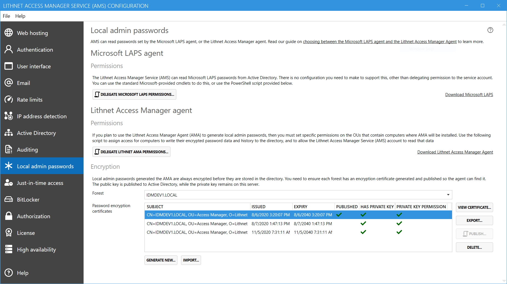

If you loose access to the encryption certificate's private key, any current and historical passwords encrypted with that key are not recoverable. This is why backups are so important. 

In order to restore local admin password access to your environment, you need to publish a new key, and force the agents to generate a new password and encrypt it with that key.

## Recovery steps

### Step 1: Generate a new certificate
From the Access Manager Service configuration tool, visit the [[local admin passwords page]], select the forest you need to recover from the drop-down list, and click `Generate new...`. 



### Step 2: Backup the new certificate
Once the certificate has been generated, click `View certificate...` and on the `Details` tab, select `Copy to file...` to backup this key. Make sure you select the option to export the private key. Choose a strong password, and keep this file safe, preferably in an offline location.

### Step 3: Publish the new certificate
Once you've secured you backup key, click `Publish` to generate a new script to publish this certificate to AD. Run the script as a domain admin of the root forest.

### Step 4: Force expire all computer passwords
In order to force clients to immediately generate a new password, we must set the `lithnetPasswordExpiry` attribute on each computer to `0`. 

You can use the following script to do this. Set the `$ou` variable to the DN of the container where the computers are located, or leave it as-is to expire the password of all computers in the domain.

```ps
# Set the OU variable to the DN of the container containing the computers that need their passwords reset, or leave it blank to reset all computers in the domain
$ou = ""

if ($ou -eq "")
{
    $ou = (Get-ADDomain).DistinguishedName
}

$InformationPreference = "Continue"

Get-ADComputer -SearchBase $ou -SearchScope Subtree -Properties DistinguishedName -LDAPFilter "(objectCategory=computer)" | % {
    $_ | Set-AdComputer -Replace @{lithnetAdminPasswordExpiry=0}
    Write-Information "Expired password on computer $($_.Name)"       
 }
 ```

When the agent next runs (by default this is every 60 minutes) it will detect that it's password has been expired, and generate a new password, and encrypt it using the newly published certificate in the directory.

If you are using the password history feature, those previously used passwords can no longer be decrypted. You should delete them from the directory using the following script to avoid users being presented with `Password could not be decrypted` warnings in the web UI. 

```ps
# Set the OU variable to the DN of the container containing the computers that need their password history cleared, or leave it blank to clear the history from all computers in the domain
$ou = ""

if ($ou -eq "")
{
    $ou = (Get-ADDomain).DistinguishedName
}

$InformationPreference = "Continue"

Get-ADComputer -SearchBase $ou -SearchScope Subtree -Properties DistinguishedName -LDAPFilter "(objectCategory=computer)" | % {
    $_ | Set-AdComputer -Clear "lithnetAdminPasswordHistory"
    Write-Information "Cleared password history for computer $($_.Name)"       
 }
 ```