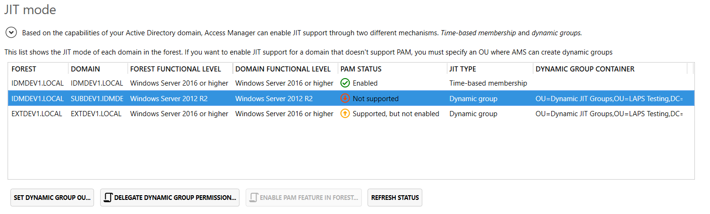
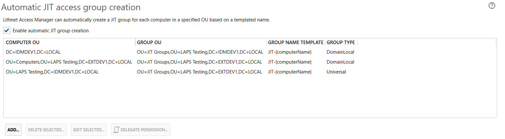
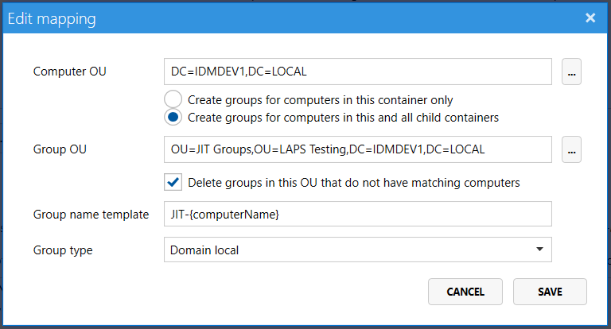
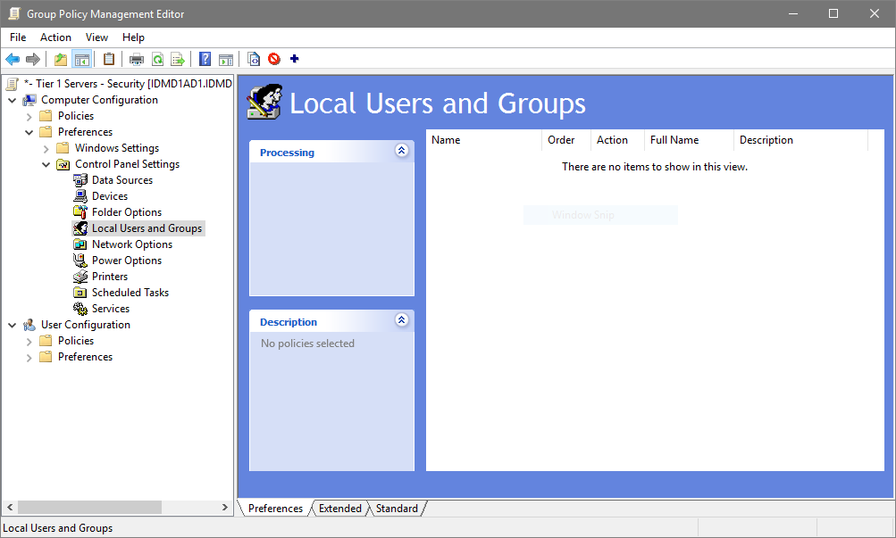
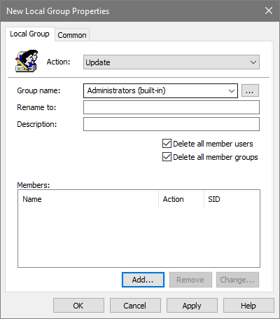
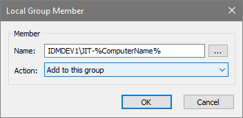
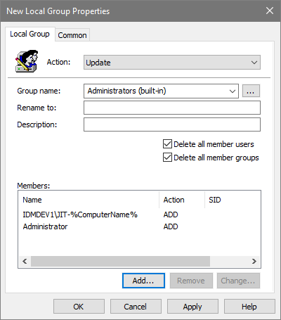
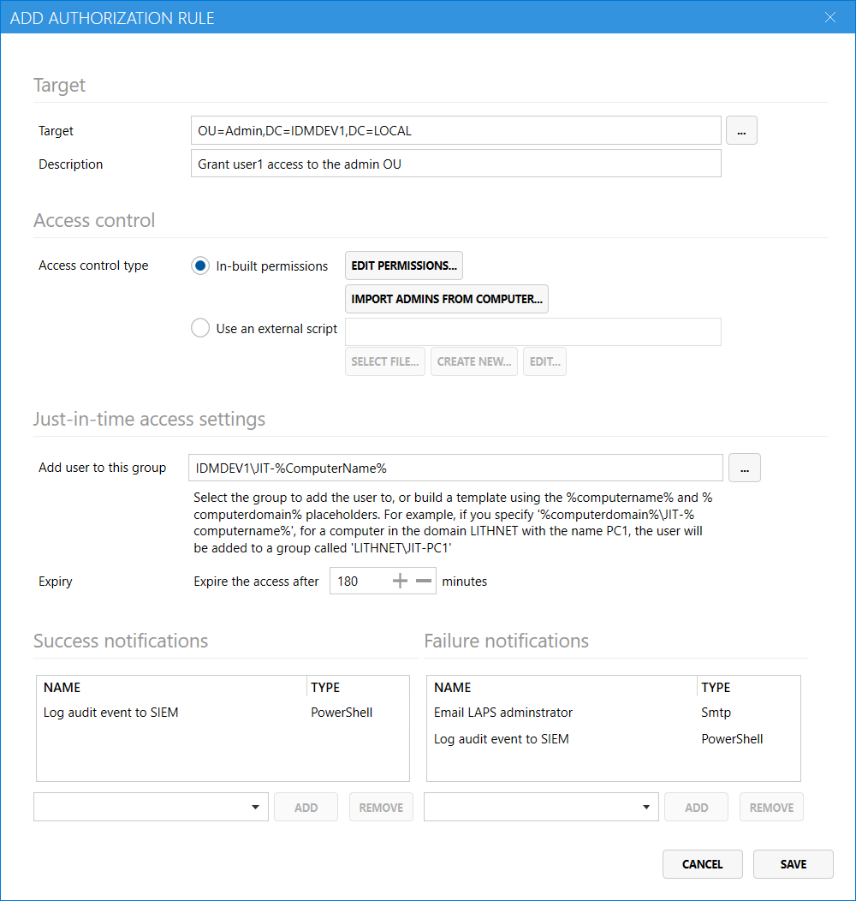
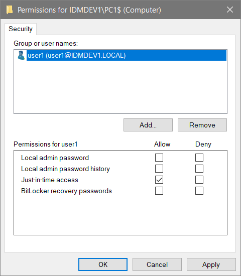

Lithnet Access Manager supports granting administrative access to computers using a simple just-in-time access model. Rather than having administrators permanently being a member of each computer's local administrator group, they can use Access Manager to grant themselves administrative access on a temporary as-needed basis.

By removing all permanent administrators from your computers, you increase the difficulty of a successful lateral-movement based attack. 

At a high level, in order to enable just-in-time access the following tasks need to be completed;

1. An empty AD group is created for each computer. This is the group used to grant JIT access. 
2. Those groups are each added to the local administrators group of their corresponding computer
3. All members except for the built-in administrator account and the JIT group are removed from the local administrators group
4. The members who were removed are then granted access through an Access Manager authorization rule.

## Step 1: Prepare the Active Directory
Access Manger's JIT functionality works with any version of Active Directory from Windows Server 2003 and above, but the underlying mechanism used depends on the forest functional level.

### Windows Server 2012 forest functional level and below
When interacting with Active Directory forests with a functional level at or below Windows Server 2012, Access Manager uses a mechanism called [dynamic objects](https://docs.microsoft.com/en-us/windows/win32/ad/dynamic-objects). A dynamic object is a directory object with a time-to-live value defined at creation time. When the time-to-live period expires, the dynamic object automatically disappears. 

When a user is granted JIT access to a computer, Access Manager creates a new temporary dynamic group, that is set to be deleted when the configured access period expires. The requestor is added to the dynamic group and that dynamic group is added to the JIT group for the computer. When the dynamic object is deleted, the group membership is automatically removed.

`User (member of) -> Temporary dynamic group (member of) -> JIT group`

If you are operating at this forest functional level, you must create an OU in your directory where AMS can create the dynamic group objects. From the [[JIT Access Page|Jit-Access-Page]], select your forest, click `Set Dynamic Group OU` button. Choose an OU in your directory. Once you have done that, use the `Delegate dynamic group permission` script to grant the AMS service account rights to create groups in this OU.

### Windows Server 2016 forest functional level and above
In Active Directory forests with a Windows 2016 or higher forest functional levels can take advantage of a new feature called time-based membership. This has several advantages over the dynamic group model. In this model when a user is granted JIT access to a computer, Access Manager adds the user directly to the JIT group, but it can tell Active Directory that the group membership itself is time-limited. The user is added to the group with a time-to-live value and after that time, the user is automatically removed from the group by Active Directory. 

`User (time-limited member of) -> Jit group`

Unlike in pre-2016 forest functional levels, this mechanism doesn't require creating dynamic groups.

Time-based membership is part of the [Privileged Access Management optional forest feature](https://docs.microsoft.com/en-us/openspecs/windows_protocols/ms-adts/d079eee8-1bac-4b03-86e4-506a21450905) and must be explicitly enabled. 

You can use the `Enable PAM feature in forest` script to enable this feature in your forest. 

If you do not wish to enable the PAM feature, you can follow the steps above to simply enable dynamic group support as if it was a down-level forest.

## Step 2: Creating the JIT groups
Best practice for JIT is that each computer that you want to enable JIT for, has a dedicated JIT group created for it in AD. The Access Manager Service contains a feature that allows you to automatically create a JIT group for each computer.

From the [[Jit Access|Jit-Access-Page]] page, you can enable automatic JIT group creation. Click `Add` to create a new mapping.

Select the OU that contains the computers you want to create JIT groups for and select a different OU where the JIT groups should be created. 

> It is recommended that the JIT group OU be dedicated to Access Manager JIT groups only. If the OU contains other groups, and the `delete groups in this OU that do not have matching computers` option is selected, those other groups will be deleted by Access Manager.

> **WARNING** Given that anyone with access to modify group membership in this OU can effectively become an admin of any computer managed by JIT, you must take care to secure the OU and ensure only Access Manager has access to the objects within it.

Select a group name template, making sure to include the `{computerName}` variable. For each computer found in the specified OU, AMS will use this template to create the group. For a computer called `PC1`, a template of `JIT-{computerName}` will result in the group being called `JIT-PC1`. You'll need to use this name template name when creating the authorization rule that grants users access to these computers.

Once you have saved the mapping, use the `Delegate permission` script on the JIT Access page to ensure AMS can manage group objects in the specified container.

Note, using AMS specifically to create JIT groups is not required for JIT to work. If you have an existing group management tool you'd prefer to use, you can use that instead. Just ensure AMS has access to modify the group membership for those groups.

## Step 3: Add the JIT group via group policy

Using the group policy editor, create a new group policy object and link it to the OU containing your computer objects. Open the policy and navigate to `Computer Configuration`, `Preferences`, `Control Panel Settings`, `Local Users and Groups`.

Right click the `Local users and groups` node, and select `New`, `Local group`. Click the drop down arrow on the `Group name` field, and select `Administrators (built-in)`. 

Click the `Add` button, and the group, using the `%computername%` variable, specify the templated name of the group set in step 2.

Add the built-in admin account, by creating a new member entry for `Administrator`.

If you are ready to enforce JIT access, select the `Delete all member users` tick box, as well as the `Delete all member groups`. This will ensure that only the built-in administrator, the JIT group and any members specified in this policy are in the local administrators group.

It is recommended that you only turn this on after appropriate testing, and once all existing administrators have been granted access through an AMS authorization rule.

If you have additional users or groups that should also be in the local administrators group, then you can add those to the list. Remember, in order to prevent lateral movement with administrator rights, no accounts should have permanent administrative rights. Use this feature temporarily, to assist in an orderly transition to removing permanent admin rights, or in very limited circumstances.

> Note, if you are currently using the older Windows `Restricted groups` policies, you'll need to convert that membership to use the new group-policy preferences style. The restricted groups policy does not allow use of the `%computername%` variable. The functionality provided by restricted groups is available in group policy preferences.

## Step 4: Assign access
Once the policy configured you can now configure access to individual users and groups using the AMS configuration tool.

From the `Authorization` page, select `Add...` to create a new target. Select the OU containing the computers enabled for JIT and provide a friendly description for this rule. This will appear in audit logs if a user is granted access. 

Select `Edit Permissions...` to open the ACL editor. Assign the appropriate users and groups permission to allow JIT access.

You must provide the group name or template in the `Just-in-time access settings` area, as well as the length of time until the access is expired.  

If you'd like to be notified when someone requests JIT access, select the notification channels you'd like to send to for success and failure events.

## Step 5: Validate access
Log in to the access manager web app as an authorized user, and request JIT access to a computer. If you have performed the steps correctly, you should be able to log into the server with local administrator rights.
