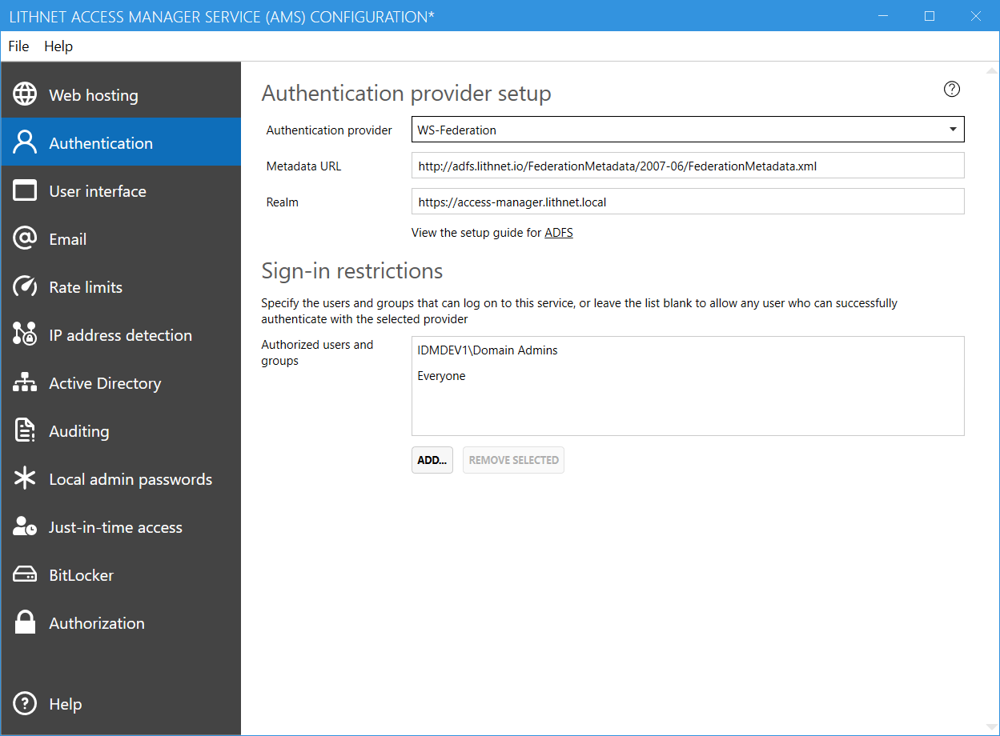

The following guide will assist you in configuring your application to use Active Directory Federation Services (ADFS) for authentication. 

## Part 1: Configure a new replying party trust in ADFS
1. Open the ADFS console, expand `Trust Relationships`, right-click `Relying Part Trusts` and select `Add relying-party trust`
2. Click `Next` and select `Enter data about the relying party manually`
3. Specify `Lithnet Access Manager` as the display name
4. Select `AD FS profile`
5. Skip the encryption certificate step
6. Check the box to `Enable support for the WS-Federation Passive protocol`. Specify the base URL where your Lithnet Access Manager is hosted (eg `https://accessmanager.lithnet.local/`)
7. Skip the page prompting you to add additional relying party trust identifiers
8. Optionally, configure multi-factor authentication for the trust, and follow the remaining pages through to completion
9. Edit the claim rules for the application. Add a new issuance transform rule to `Send LDAP attributes as claims`
10. Set 'Issue UPN' as the claim rule name. Select `Active Directory` as the attribute store, `User-Principal-Name` as the `LDAP Attribute` and `UPN` as the outgoing claim type

## Part 2: Configure Lithnet Access Manager

1. In the `metadata` field, provide the metadata URL for your ADFS server (usually something like `https://adfs.lithnet.local/FederationMetadata/2007-06/FederationMetadata.xml`)
2. Enter the base URL of your application in the `Realm` field.