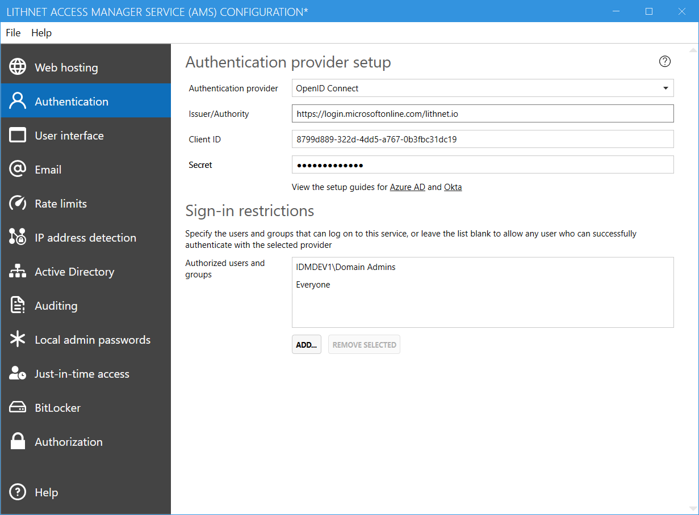

The following guide will assist you in configuring your application to use Azure Active Directory for authentication. 
## Part 1: Configure a new application in Azure AD
1. Log into portal.azure.com with administrative credentials, select `All services` and select `Azure Active Directory`
2. Select `App registrations` and click `New application registration`
3. Enter `Lithnet Access Manager` or another suitable application name, and select `Accounts in this organizational directory only (Lithnet only - Single tenant)` as the supported account type
4. Select `Web` as the application type
5. In the `redirect URI` field, enter the base URL where your Access Manager web app is hosted followed by `/auth/` (eg `https://accessmanager.lithnet.local/auth/`)
6. Click `Register`
7. Take note of the `Application ID` value, this is our OpenID Connect client ID
8. From the left-hand menu, click `Authentication` and then `Properties`. Set the Logout URL to be the same as your base URL, with `/auth/logout` appended to it. (eg `https://accessmanager.lithnet.local/auth/logout`)
9. Save the settings
10. From the `API permissions` page, use the `grant admin consent` if you want to prevent users from being prompted for their consent when logging into the app.
11. From the `Certificates and secrets` page, click `new client secret`, give your secret a name, and then take note of the value provided.

## Part 2: Configure Lithnet Access Manager
1. Open the Lithnet Access Manager Service Configuration Tool
2. Select the `Authentication` page
3. Select `Open ID Connect` as the authentication provider
4. Use the `application id` obtained from the Azure AD setup process as the `client ID` value
5. Specify the `client secret` obtained from the Azure AD setup process.
6. Set the authority as appropriate for your tenant eg for `lithnet.io` it would be `https://login.microsoftonline.com/lithnet.io`

## Part 3: Enable multi-factor authentication
For further security, you can set up a conditional access policy to require multi-factor authentication for the app