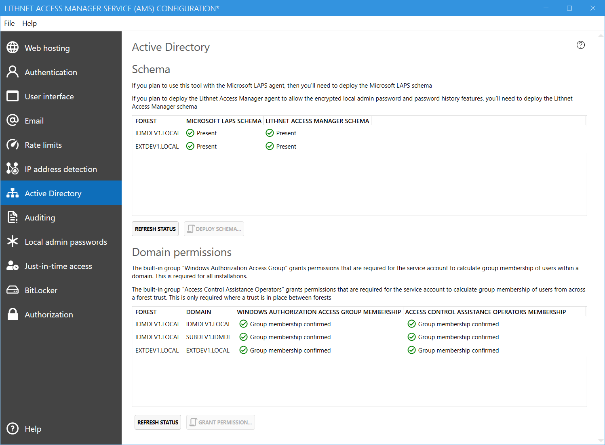
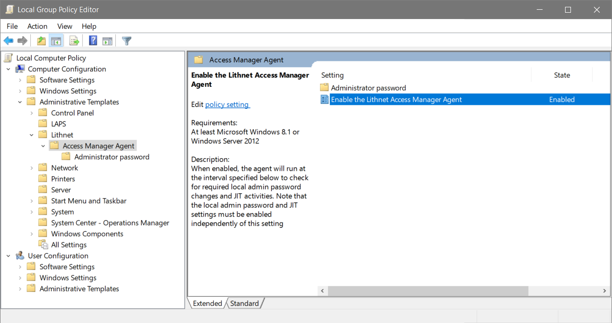
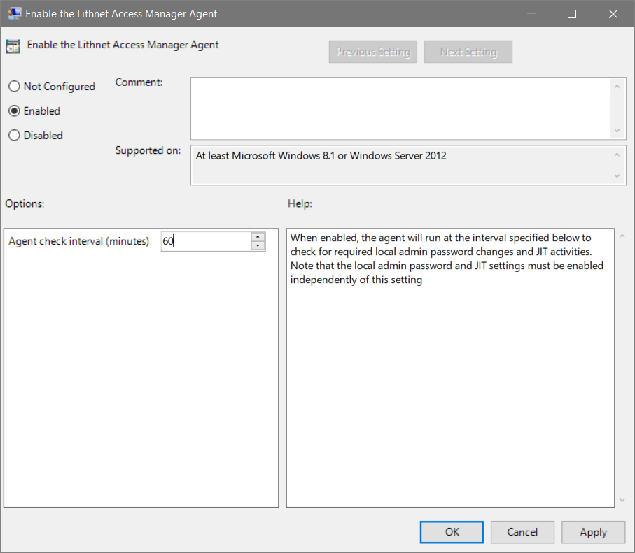
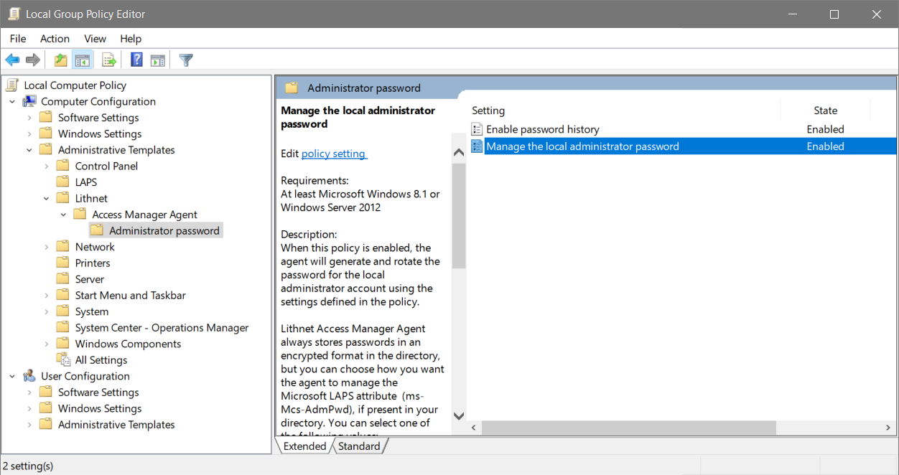
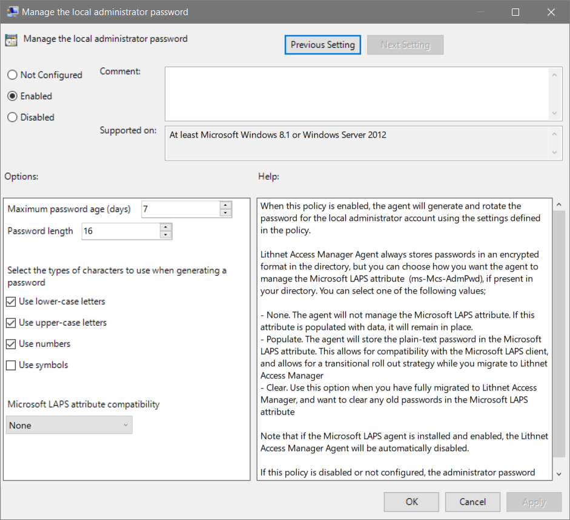
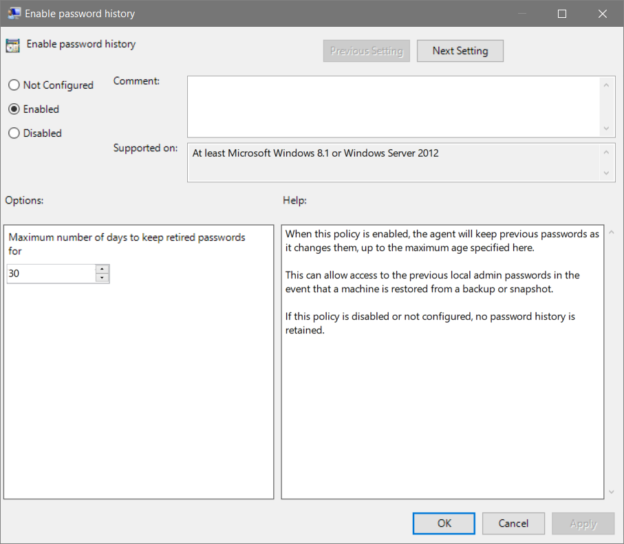
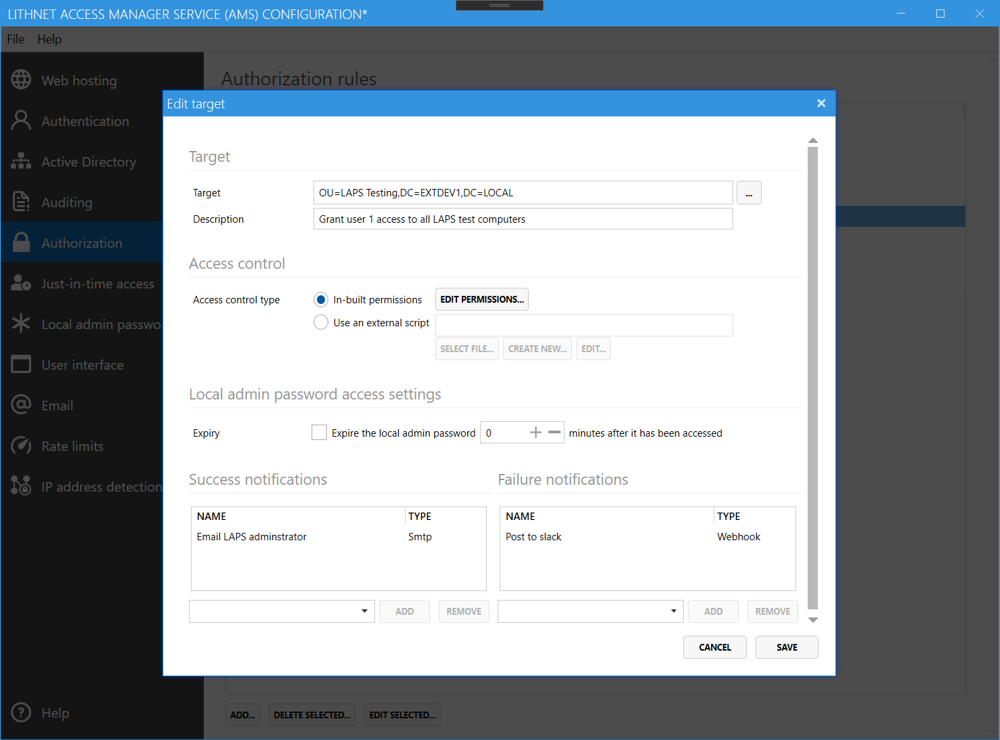

Managing passwords with the Lithnet Access Manager Agent (AMA) provides several features that are not available with the Microsoft LAPS agent.

Firstly, local admin passwords are always encrypted in the directory using a public/private key pair. Encryption using the AMA is not optional. Passwords are encrypted using AES-CBC-256, and the unique encryption key is encrypted using a 4096-bit RSA public key. The RSA private key is kept locally on the AMS server only.

The AMA can also keep a history of local admin passwords, which is useful in the event that you rollback a VM snapshot, or restore a server from a backup. You can configure how many days you retain historical passwords for.

## Step 1: Deploy the Access Manager Agent schema

The use of the Access Manager Agent requires schema extensions to be deployed to the Active Directory. The schema extensions add the following attributes to the `computer` object class

- lithnetAdminPassword
- lithnetAdminPasswordHistory
- lithnetAdminPasswordExpiry

It will also add a new object class called `lithnetAccessManagerConfig` for storing the public key of the encryption certificate. The encryption certificate is always stored in the configuration context of the root domain at `CN=AccessManagerConfig,CN=Lithnet,CN=Services,CN=Configuration,DC=X`

From the `Active Directory` tab in the configuration tool, select a forest, and click `Deploy schema` to open a schema deployment script, pre-configured for that forest. Copy this script and run it as a member of the `Schema Admins` group. Repeat the process for any additional forests where you need to deploy the Access Manager Agent.

Once the schema is deployed, click the `refresh schema` button to check and validate that the schema has been deployed.

## Step 2: Delegate Access Manager Agent permissions

From the `Local admin passwords` page, click on `Delegate Lithnet AMA Permissions` to see a pre-built script for delegating the appropriate permissions. Simply change the `ou` variable to the full DN of the container than contains the computers you want to be able to access with AMS.

Copy this script, and run it with an account that has either domain admin rights, or delegated control of the specified container.

This script will grant permission for computer objects to update their own `lithnetAdminPassword` attributes, as well as grant the service account permission to read these attributes.

## Step 3: Configure encryption
On the `Local admin passwords` page, select a forest from the drop down list in the `encryption` section, and select `Generate new...` to create a new encryption certificate. This will generate a certificate for this forest, storing the private key in the 'personal' certificate store of the service. Click `Publish...` to generate a deployment script that will publish this certificate in the directory. Run the script as a domain admin of the root domain in the forest.

Click on `View Certificate` and export a backup of the certificate and store it somewhere very safe. This certificate can decrypt all passwords in this forest, so it is important that you keep it secure and have a backup. There is no way to decrypt the local admin passwords if you lose this certificate.  

Repeat the process for any additional forests you want to deploy the agent to.

## Step 4: Deploy the Access Manager Agent

Download the Access Manager Agent and deploy it to the computers in your environment. The agent requires .NET Framework 4.7.2 or higher to be installed on the machine in advance of the agent being installed.

If you have the Microsoft LAPS agent deployed, you must either disable it with group policy, or uninstall it from the machine. The Access Manager Agent will not take over management of the local administrator password while Microsoft LAPS is active.

## Step 5: Configure the Access Manager Agent group policy

When you install the Access Manager Agent on a computer, the group policy ADMX files get automatically installed. However, if you are using a central policy store, you'll need to manually copy the ADMX and ADML files to the store.

The following files need to be copied

- `C:\Windows\PolicyDefinitions\lithnet.admx`
- `C:\Windows\PolicyDefinitions\lithnet.accessmanager.agent.admx`
- `C:\Windows\PolicyDefinitions\lithnet.accessmanager.agent.password.admx`
- `C:\Windows\PolicyDefinitions\en-US\lithnet.adml`
- `C:\Windows\PolicyDefinitions\en-US\lithnet.accessmanager.agent.adml`
- `C:\Windows\PolicyDefinitions\en-US\lithnet.accessmanager.agent.password.adml`

The central policy store is located at `\\<domain>\sysvol\<domain>\Policies\PolicyDefinitions`

Using the group policy editor, create a new group policy object, and link it to the OU containing your computer objects. Open the policy and navigate to `Administrative Templates`, `Lithnet`, `Access Manager Agent`.

Edit the `Enable the Lithnet Access Manager Agent` policy, and specify how frequently the agent should run.

Open the `Administrator Password` folder, and enable the policy `Manage the local administrator password`

Set the maximum age of the password, the password length, and the character types to use in the password. 

Optionally, you can specify to store the password in plain-text in the Microsoft LAPS attribute (`ms-Mcs-AdmPwd`). This is useful if you are performing a phased rollout of the Access Manager Agent, and need to maintain compatibility with the Microsoft LAPS client.

If you want to enable keeping a record of previous local admin passwords, then enable the `Enable password history` policy item, and specify the number of days that you want to keep previous passwords for.

## Step 6: Assign access
Once the agent is deployed, and the policy configured, you can now configure access to individual users and groups using the AMS configuration tool.

From the `Authorization` page, select `Add...` to create a new target. Select the OU you delegated permissions to, and provide a friendly description for this rule. This will appear in audit logs if a user is granted access. 

Select `Edit Permissions...` to open the ACL editor. Assign the appropriate users and groups permission to read the local admin password, and optionally, the local admin password history.

You can optionally choose to expire the local admin password a period of time after it has been accessed. This will cause the Access Manager Agent to generate a new password _after_ its next check-in time. The frequency of the check in is determined by the group policy 

If you'd like to be notified when someone accesses a LAPS password, select the notification channels you'd like to send to for success and failure events.

## Step 7: Validate access
Log in to the access manager web app as an authorized user, and request access to the password for a computer. If you have performed the steps correctly, you should be able to see the machines local admin password.