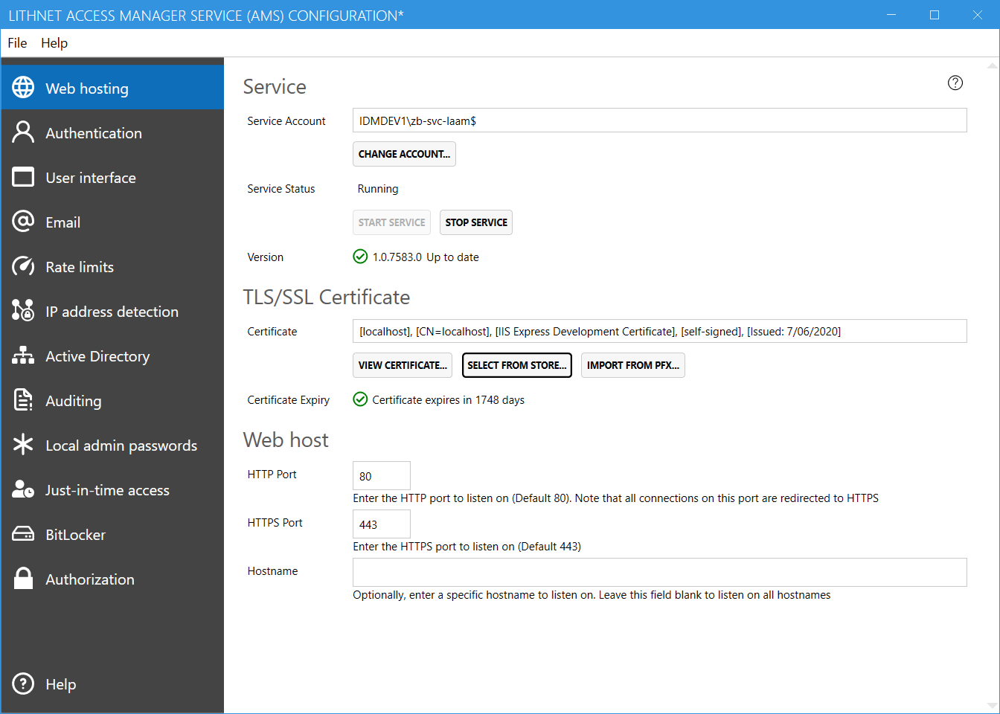

## Service
### Service account
Specifies the service account that runs the Access Manager Service application. Use a group-managed service account where ever possible.

### Service status
Indicates the run state of the Lithnet Access Manager windows service.

### Version
Shows the current installed version of Access Manager, and shows notifications when new versions are available

## TLS/SSL Certificate
### Certificate
Specify the TLS certificate used to protect HTTPS traffic to and from the web site. You can select a certificate from the local machine store, or import a PFX file.

### Certificate expiry
Shows how long until the currently selected certificate expires

## Web host
### HTTP Port
The HTTP port that the application will listen on. The default is port 80. Note that this port is only used to redirect connections to HTTPS. The application won't serve content over non HTTPS connections.

### HTTPS Port
The HTTPS port that the application will listen on. The default is port 443.

### Hostname
If you want the service to listen on a specific host name only, provide that name here. It's recommended to leave this field blank unless you really need to restrict the listener to a specific name.